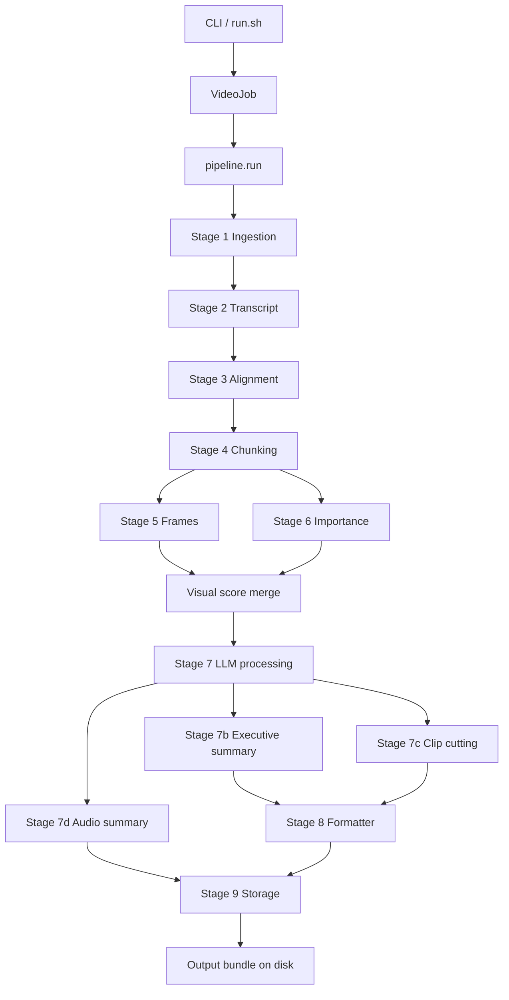

# INSIGHTFORGE ARCHITECTURE

This is the top-level architecture map for the current InsightForge codebase. It points to the deeper architecture documents for the areas that are easiest to break or hardest to reason about.

## DOC SET

- [STORAGE_ARCHITECTURE.md](/Users/akarnik/experiments/InsightForge/docs/STORAGE_ARCHITECTURE.md)
- [HTML_VIEWER_ARCHITECTURE.md](/Users/akarnik/experiments/InsightForge/docs/HTML_VIEWER_ARCHITECTURE.md)
- [HTML_AI_CHAT_ARCHITECTURE.md](/Users/akarnik/experiments/InsightForge/docs/HTML_AI_CHAT_ARCHITECTURE.md)
- [LOGGING_AND_TROUBLESHOOTING.md](/Users/akarnik/experiments/InsightForge/docs/LOGGING_AND_TROUBLESHOOTING.md)

## REPOSITORY SHAPE

```text
insightforge/
├── cli.py
├── pipeline.py
├── audio.py
├── viewer_server.py
├── llm/
├── models/
├── stages/
├── storage/
└── utils/
```

Primary ownership:

- CLI entry points: [insightforge/cli.py](/Users/akarnik/experiments/InsightForge/insightforge/cli.py)
- pipeline orchestration: [insightforge/pipeline.py](/Users/akarnik/experiments/InsightForge/insightforge/pipeline.py)
- LLM routing: [insightforge/llm/router.py](/Users/akarnik/experiments/InsightForge/insightforge/llm/router.py)
- stage implementations: `insightforge/stages/*`
- persisted output: [insightforge/storage/writer.py](/Users/akarnik/experiments/InsightForge/insightforge/storage/writer.py)
- static HTML viewer: [insightforge/storage/html_export.py](/Users/akarnik/experiments/InsightForge/insightforge/storage/html_export.py)
- hosted viewer chat: [insightforge/viewer_server.py](/Users/akarnik/experiments/InsightForge/insightforge/viewer_server.py)
- config and logging: [insightforge/utils/config.py](/Users/akarnik/experiments/InsightForge/insightforge/utils/config.py), [insightforge/utils/logging.py](/Users/akarnik/experiments/InsightForge/insightforge/utils/logging.py)

## END-TO-END FLOW



## STAGE MAP

### Stage 1: Ingestion

File:
[insightforge/stages/ingestion.py](/Users/akarnik/experiments/InsightForge/insightforge/stages/ingestion.py)

Key functions:

- `run`
- `_build_ydl_opts`
- `_find_downloaded_file`

What it does:

- downloads the source video
- extracts metadata
- creates a work directory for intermediate artifacts

### Stage 2: Transcript

File:
[insightforge/stages/transcript.py](/Users/akarnik/experiments/InsightForge/insightforge/stages/transcript.py)

Key functions:

- `run`
- `_try_youtube_transcript`
- `_transcribe_whisper`

What it does:

- uses YouTube captions when available and preferred
- otherwise falls back to local Whisper transcription

### Stage 3: Alignment

File:
[insightforge/stages/alignment.py](/Users/akarnik/experiments/InsightForge/insightforge/stages/alignment.py)

Key functions:

- `run`
- `_strip_noise_segments`
- `_normalise_whitespace`
- `_fill_gaps`

What it does:

- cleans up transcript segments
- normalizes text
- fills small timing gaps

### Stage 4: Chunking

File:
[insightforge/stages/chunking.py](/Users/akarnik/experiments/InsightForge/insightforge/stages/chunking.py)

Key functions:

- `run`
- `_chunk_by_token`
- `_chunk_by_sentence`
- `_chunk_hybrid`

What it does:

- converts transcript segments into chunk-sized units that later become sections

### Stage 5: Frames

Files:

- [insightforge/stages/frames.py](/Users/akarnik/experiments/InsightForge/insightforge/stages/frames.py)
- [insightforge/utils/ffmpeg.py](/Users/akarnik/experiments/InsightForge/insightforge/utils/ffmpeg.py)

What it does:

- extracts candidate frames
- adds transition frames
- limits the kept set

### Stage 6: Importance

File:
[insightforge/stages/importance.py](/Users/akarnik/experiments/InsightForge/insightforge/stages/importance.py)

Key functions:

- `run`
- `_score_chunk_llm`
- `apply_visual_scores`
- `filter_by_detail`

What it does:

- scores chunks for semantic importance
- merges visual scoring when frames exist
- drops lower-priority chunks for low-detail mode

### Stage 7: LLM Processing

File:
[insightforge/stages/llm_processing.py](/Users/akarnik/experiments/InsightForge/insightforge/stages/llm_processing.py)

Key functions:

- `run`
- `_group_topics`
- `_generate_chunk_summary`
- `_generate_topic_section`
- `_generate_leaf_section`
- `generate_executive_summary`

What it does:

- builds sections
- builds hierarchical topic structures
- attaches frames to sections
- generates the executive summary

### Stage 8: Formatter

File:
[insightforge/stages/formatter.py](/Users/akarnik/experiments/InsightForge/insightforge/stages/formatter.py)

What it does:

- renders `notes.md`
- renders `transcript.md`
- interleaves text, frames, and local clips

### Stage 9: Storage

File:
[insightforge/storage/writer.py](/Users/akarnik/experiments/InsightForge/insightforge/storage/writer.py)

What it does:

- writes the output bundle
- copies frames, clips, transcript, metadata, and source video
- optionally generates the static viewer

Detailed storage notes:
[STORAGE_ARCHITECTURE.md](/Users/akarnik/experiments/InsightForge/docs/STORAGE_ARCHITECTURE.md)

## VIEWER AND CHAT

HTML viewer generation:
[HTML_VIEWER_ARCHITECTURE.md](/Users/akarnik/experiments/InsightForge/docs/HTML_VIEWER_ARCHITECTURE.md)

Hosted HTML AI chat:
[HTML_AI_CHAT_ARCHITECTURE.md](/Users/akarnik/experiments/InsightForge/docs/HTML_AI_CHAT_ARCHITECTURE.md)

## LOGGING AND DEBUGGING

How to enable logging and debug failures:
[LOGGING_AND_TROUBLESHOOTING.md](/Users/akarnik/experiments/InsightForge/docs/LOGGING_AND_TROUBLESHOOTING.md)

Short version:

- CLI debug: `insightforge process ... --verbose`
- env override: `INSIGHTFORGE_LOG_LEVEL=DEBUG`
- config override: set `logging.level: DEBUG` in config YAML
- JSON logs: set `logging.format: json`

## FEATURE TO FILE MAP

| Feature | Files |
|---|---|
| CLI | `insightforge/cli.py` |
| Config loading | `insightforge/utils/config.py` |
| Logging setup | `insightforge/utils/logging.py` |
| Pipeline orchestration | `insightforge/pipeline.py` |
| LLM routing | `insightforge/llm/router.py` |
| Download + metadata | `insightforge/stages/ingestion.py` |
| Transcription | `insightforge/stages/transcript.py` |
| Transcript cleanup | `insightforge/stages/alignment.py` |
| Chunking | `insightforge/stages/chunking.py` |
| Frames | `insightforge/stages/frames.py`, `insightforge/utils/ffmpeg.py` |
| Importance scoring | `insightforge/stages/importance.py` |
| Section generation | `insightforge/stages/llm_processing.py` |
| Markdown rendering | `insightforge/stages/formatter.py` |
| Storage | `insightforge/storage/writer.py` |
| Static viewer export | `insightforge/storage/html_export.py` |
| Hosted viewer AI chat | `insightforge/viewer_server.py` |
| Audio regeneration | `insightforge/audio.py` |
