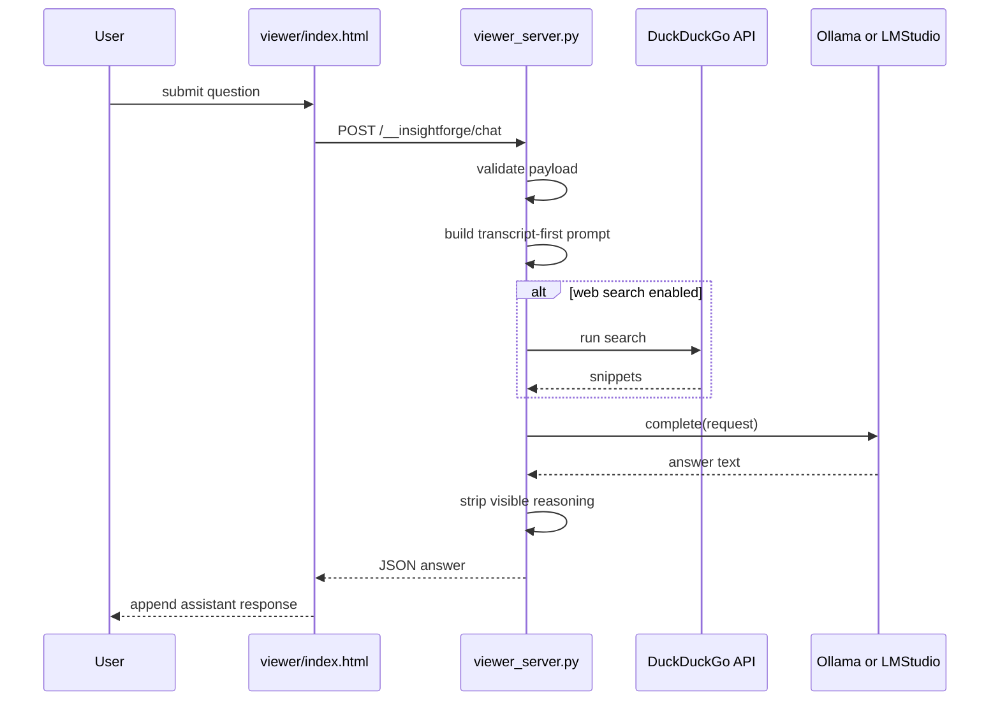
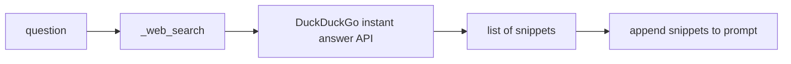

# HTML AI CHAT ARCHITECTURE

This document explains how the viewer’s transcript-aware AI chat works.

Primary implementation:

- [insightforge/viewer_server.py](/Users/akarnik/experiments/InsightForge/insightforge/viewer_server.py)
- [insightforge/storage/html_export.py](/Users/akarnik/experiments/InsightForge/insightforge/storage/html_export.py)
- [insightforge/pipeline.py](/Users/akarnik/experiments/InsightForge/insightforge/pipeline.py)
- [view.sh](/Users/akarnik/experiments/InsightForge/view.sh)

## IMPORTANT CONSTRAINT

The chat does not work from `file://` mode. The viewer must be hosted over HTTP because the browser needs to POST to the local server endpoint:

```text
/__insightforge/chat
```

That is why `view.sh --host-html` exists.

## CHAT FLOW



## FRONTEND SIDE

The viewer page contains the chat UI and client logic inside generated JavaScript.

Important generated functions:

- `appendChatMessage`
- `setChatStatus`
- `updateChatContextLength`
- `submitChatQuestion`
- `openChatPopup`

These live inside:
[insightforge/storage/html_export.py](/Users/akarnik/experiments/InsightForge/insightforge/storage/html_export.py#L1110)

The page sends JSON shaped roughly like:

```json
{
  "question": "...",
  "transcript": [...],
  "history": [...],
  "title": "...",
  "chat": {...},
  "web_search": true
}
```

## SERVER SIDE

Entry point:
[insightforge/viewer_server.py](/Users/akarnik/experiments/InsightForge/insightforge/viewer_server.py#L19)

Main components:

- `ViewerRequestHandler.do_POST`
- `_chat_answer`
- `_history_block`
- `_strip_reasoning`
- `_web_search`

## PROMPT CONSTRUCTION THEORY

The chat server is transcript-first, not web-first.

Prompt ingredients:

- video title
- full transcript text, rebuilt as timestamped lines
- recent chat history
- current question
- optional web search snippets

The prompt explicitly tells the model:

- answer from the transcript first
- say when the transcript is insufficient
- use general knowledge only secondarily

That logic lives in:
[insightforge/viewer_server.py](/Users/akarnik/experiments/InsightForge/insightforge/viewer_server.py#L47)

## PROVIDER SELECTION

Viewer chat config is created by:
[insightforge/pipeline.py](/Users/akarnik/experiments/InsightForge/insightforge/pipeline.py#L491)

Rules:

- API mode: chat disabled
- local mode + LMStudio config present: LMStudio
- otherwise: Ollama

At request time, `_chat_answer` constructs either:

- `OpenAIProvider` for LMStudio
- `OllamaProvider` for Ollama

## WHY THE SERVER EXISTS

The generated viewer is mostly static, but chat needs server-side behavior for:

- transcript-aware prompt assembly
- provider calls
- optional web search
- removing reasoning traces before sending text back to the browser

Without the server, the page has nowhere to send the chat request.

## WEB SEARCH PATH



Implementation:
[insightforge/viewer_server.py](/Users/akarnik/experiments/InsightForge/insightforge/viewer_server.py#L134)

Important behavior:

- web results are optional supporting context
- transcript remains the primary source

## CHAT HISTORY THEORY

The browser sends recent turns, and the server converts up to the last 8 into a short text block via `_history_block`.

That means:

- the model has continuity across turns
- the page itself owns the in-browser conversation state
- refreshing the page resets client-side chat state

## POPUP CHAT

The viewer also supports a popout chat window. The popup is not a separate app; it mirrors the same in-page chat state and reuses the same server endpoint.

Client-side ownership:
[insightforge/storage/html_export.py](/Users/akarnik/experiments/InsightForge/insightforge/storage/html_export.py#L1192)

## COMMON FAILURE MODES

### Chat works badly or not at all in a directly opened HTML file

Cause:

- the page is running under `file://`, not HTTP

Fix:

- use `./view.sh --host-html`

### Chat UI exists, but the server returns an error

Possible causes:

- viewer chat disabled by config
- unsupported provider config
- local model server not reachable
- malformed request payload

### Page says hosted mode is required

Cause:

- `submitChatQuestion` detected a non-HTTP protocol

### AI responds with reasoning traces or internal markup

Relevant cleanup function:

- `_strip_reasoning`

If visible reasoning still leaks through, this function is where to inspect first.

## HOW TO DEBUG AI CHAT

### Server startup path

Hosted mode is launched from:
[view.sh](/Users/akarnik/experiments/InsightForge/view.sh#L320)

It runs:

```bash
python -m insightforge.viewer_server --root "$OUTPUT_DIR" --port "$PORT"
```

### What to check first

1. Are you using `--host-html` rather than opening `index.html` directly?
2. Is the browser POSTing to `/__insightforge/chat`?
3. Is the configured local provider reachable?
4. Does the generated `DATA.chat` config match the intended provider?

### Browser-side debugging

Use devtools:

- Network tab: inspect the POST request and response body
- Console: inspect fetch failures or JS errors

### Python-side debugging

There is currently no dedicated logging inside `viewer_server.py`, so debugging is mostly:

- endpoint behavior
- provider availability
- browser network inspection

If you need deeper tracing in this area, the next useful change would be to add explicit request/response logging in `viewer_server.py`.

## TESTS TO WATCH

- [tests/unit/test_viewer_server.py](/Users/akarnik/experiments/InsightForge/tests/unit/test_viewer_server.py)
- [tests/unit/test_html_export.py](/Users/akarnik/experiments/InsightForge/tests/unit/test_html_export.py)
