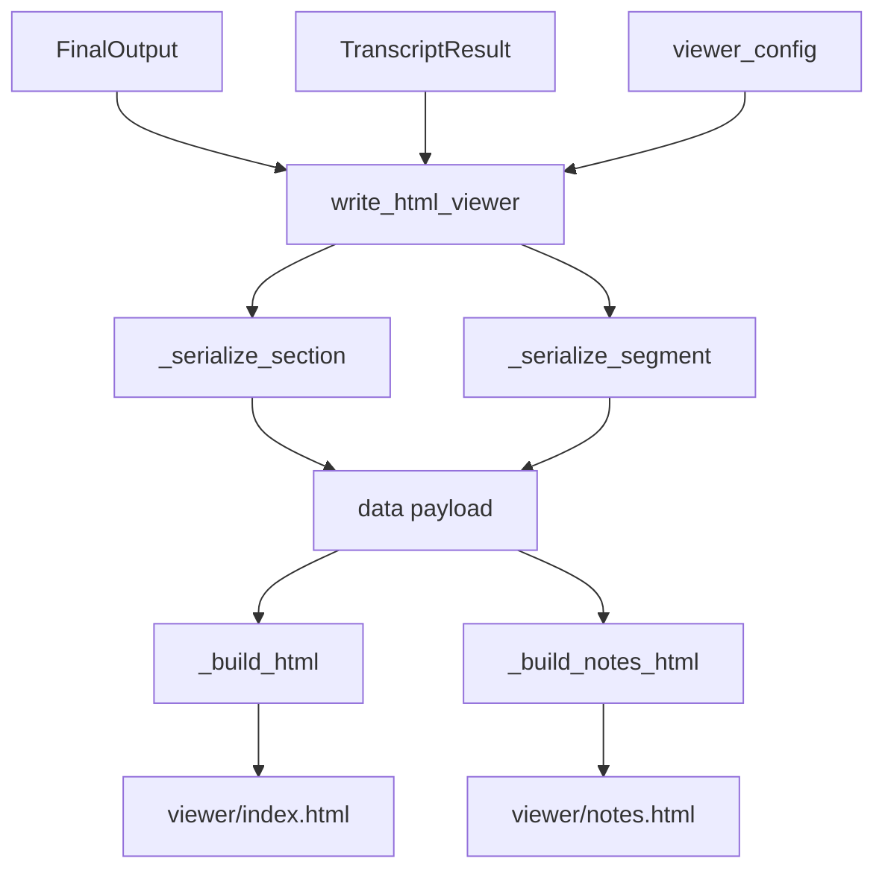
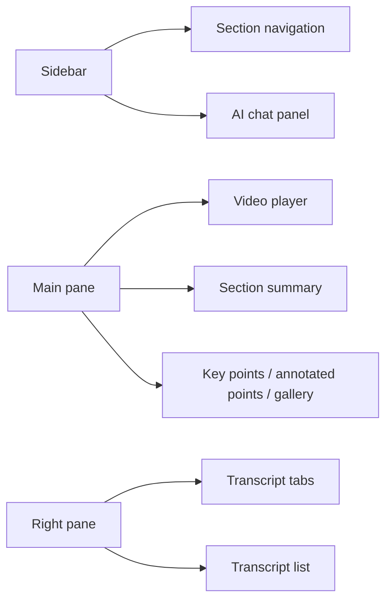
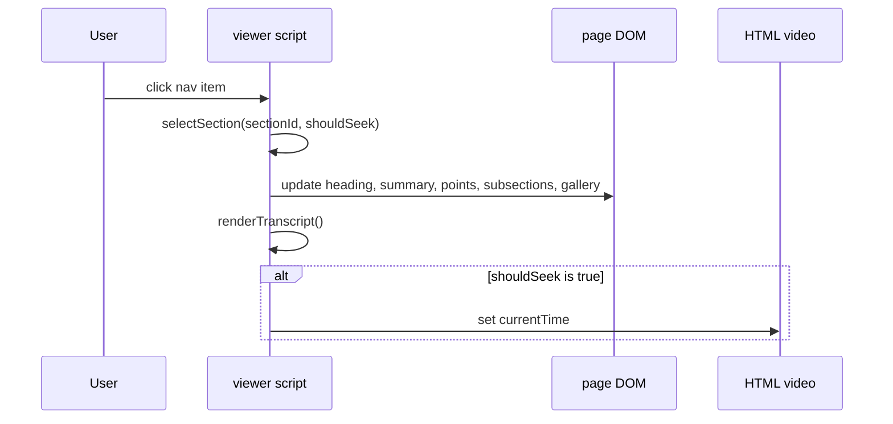
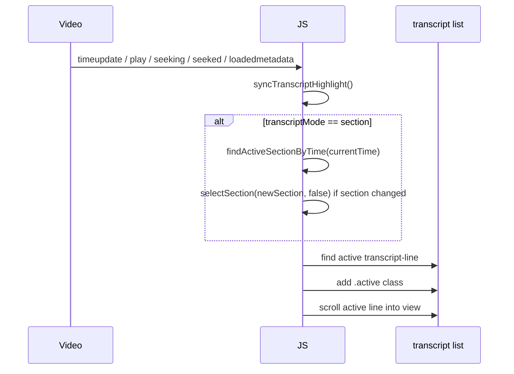

# HTML VIEWER ARCHITECTURE

This document covers the static HTML viewer generated for each processed output bundle.

Primary implementation:

- [insightforge/storage/html_export.py](/Users/akarnik/experiments/InsightForge/insightforge/storage/html_export.py)
- [insightforge/storage/writer.py](/Users/akarnik/experiments/InsightForge/insightforge/storage/writer.py)

## WHAT THE VIEWER IS

The viewer is a generated static HTML application. It is not a separate frontend project. There is no React, build step, or asset pipeline. The CSS, HTML, and browser-side JavaScript are emitted directly from Python.

Generated files:

- `viewer/index.html`
- `viewer/notes.html`

## BUILD FLOW



Main entry point:
[insightforge/storage/html_export.py](/Users/akarnik/experiments/InsightForge/insightforge/storage/html_export.py#L15)

## DATA MODEL FOR THE GENERATED PAGE

The Python code builds a payload that is embedded directly into the page as:

```js
const DATA = {...}
```

Core payload fields:

- `title`
- `channel`
- `duration`
- `video_url`
- `video_path`
- `notes_html_path`
- `chat`
- `sections`
- `transcript`

Section serialization function:
[insightforge/storage/html_export.py](/Users/akarnik/experiments/InsightForge/insightforge/storage/html_export.py#L48)

Transcript serialization function:
[insightforge/storage/html_export.py](/Users/akarnik/experiments/InsightForge/insightforge/storage/html_export.py#L105)

## PAGE LAYOUT

The generated `index.html` has three main panes:



High-level ownership:

- sidebar + nav rendering: generated JS in `_build_html`
- video area: generated HTML in `_build_html`
- transcript pane: generated HTML and JS in `_build_html`

## IMPORTANT FUNCTIONS IN THE GENERATED SCRIPT

These functions are emitted into `viewer/index.html` by `_build_html`.

Navigation and section state:

- `renderNav`
- `renderNavItem`
- `findSection`
- `selectSection`

Viewer content:

- `buildAnnotatedPoints`
- `getEffectiveFrames`
- `flattenSubsectionFrames`
- `dedupeFrames`

Transcript behavior:

- `renderTranscript`
- `syncTranscriptHighlight`
- `startTranscriptTracking`
- `stopTranscriptTracking`
- `findActiveSectionByTime`

Utilities:

- `seekTo`
- `escapeHtml`

## SECTION SELECTION FLOW



Function:
[insightforge/storage/html_export.py](/Users/akarnik/experiments/InsightForge/insightforge/storage/html_export.py#L823)

## TRANSCRIPT RENDERING THEORY

The transcript pane can show one of two datasets:

- `Selected Section`
- `Full Transcript`

Implementation rule:

- in section mode, the transcript list is rendered from `currentSection.transcript`
- in full mode, the transcript list is rendered from `DATA.transcript`

Function:
[insightforge/storage/html_export.py](/Users/akarnik/experiments/InsightForge/insightforge/storage/html_export.py#L974)

## TRANSCRIPT HIGHLIGHT + AUTO-SCROLL FLOW



Relevant functions:

- [insightforge/storage/html_export.py](/Users/akarnik/experiments/InsightForge/insightforge/storage/html_export.py#L909)
- [insightforge/storage/html_export.py](/Users/akarnik/experiments/InsightForge/insightforge/storage/html_export.py#L1015)
- [insightforge/storage/html_export.py](/Users/akarnik/experiments/InsightForge/insightforge/storage/html_export.py#L1044)

Basic theory:

- the viewer maintains a current section
- the transcript pane only has lines for that section in section mode
- so playback has to update section state before line highlighting can work
- once the correct transcript lines are in the DOM, highlighting is a pure “find active time range” problem

## WHY VIEWER BUGS HAPPEN

Common classes of bugs:

- stale generated HTML after Python generator code changed
- wrong relative media paths
- transcript lines rendered for one section while playback is in another
- browser event listeners not firing because the video element is missing
- active line selection logic too strict around boundary times

## NOTES-ONLY PAGE

The simpler notes page is generated by:

- `_build_notes_html`
- `_render_notes_section`
- `_render_notes_subsection`

This page is static content only. It has no interactive transcript, no video syncing, and no AI chat.

## HOW TO DEBUG VIEWER PROBLEMS

### 1. Distinguish generator code from generated HTML

Check both:

- [insightforge/storage/html_export.py](/Users/akarnik/experiments/InsightForge/insightforge/storage/html_export.py)
- the actual generated `<output>/viewer/index.html`

If the Python generator changed but the exported HTML did not, the browser will still show old behavior.

### 2. Confirm the source video exists

The viewer’s transcript syncing depends on a working local video element.

Check:

- `<output>/video/source.*`
- embedded `DATA.video_path`

### 3. Use browser devtools

For viewer-only issues, browser tools are often more useful than Python logs.

Inspect:

- Console: JS errors
- Elements: whether `.transcript-line.active` is applied
- Network: media path failures when hosted over HTTP

### 4. Verify which transcript mode is active

The viewer behaves differently in:

- `section`
- `full`

The rendering logic is intentionally different.

### 5. Re-export if needed

If the output page is stale, rerun with HTML export enabled:

```bash
insightforge process "<url>" --html on
```

## TESTS TO WATCH

- [tests/unit/test_html_export.py](/Users/akarnik/experiments/InsightForge/tests/unit/test_html_export.py)
- [tests/unit/test_writer.py](/Users/akarnik/experiments/InsightForge/tests/unit/test_writer.py)
