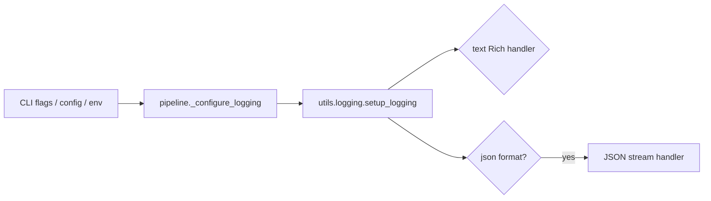

# LOGGING AND TROUBLESHOOTING

This document explains how to enable logs and how to investigate failures in the storage, viewer, and HTML AI chat areas.

Primary implementation:

- [insightforge/utils/logging.py](/Users/akarnik/experiments/InsightForge/insightforge/utils/logging.py)
- [insightforge/utils/config.py](/Users/akarnik/experiments/InsightForge/insightforge/utils/config.py)
- [insightforge/pipeline.py](/Users/akarnik/experiments/InsightForge/insightforge/pipeline.py)
- [insightforge/cli.py](/Users/akarnik/experiments/InsightForge/insightforge/cli.py)

## HOW LOGGING IS WIRED



Relevant functions:

- `pipeline._configure_logging`
- `utils.logging.setup_logging`
- `utils.logging._setup_rich_logging`
- `utils.logging._setup_json_logging`
- `utils.logging.get_logger`

## WAYS TO ENABLE LOGGING

### 1. CLI flag

```bash
insightforge process "<url>" --verbose
```

Source:
[insightforge/cli.py](/Users/akarnik/experiments/InsightForge/insightforge/cli.py#L34)

What it does:

- sets the root logger to `DEBUG` early in the CLI

### 2. Config YAML

In [config/default.yaml](/Users/akarnik/experiments/InsightForge/config/default.yaml#L68) or your override config:

```yaml
logging:
  level: DEBUG
  format: text
```

Supported formats in current code:

- `text`
- `json`

### 3. Environment variable

```bash
INSIGHTFORGE_LOG_LEVEL=DEBUG insightforge process "<url>"
```

Source:
[insightforge/utils/config.py](/Users/akarnik/experiments/InsightForge/insightforge/utils/config.py#L80)

## JSON LOGGING

If you want machine-readable logs:

```yaml
logging:
  level: DEBUG
  format: json
```

or with a config override file:

```bash
insightforge process "<url>" --config ./my-debug-config.yaml
```

JSON mode is implemented in:
[insightforge/utils/logging.py](/Users/akarnik/experiments/InsightForge/insightforge/utils/logging.py#L40)

Fields currently emitted:

- `ts`
- `level`
- `logger`
- `msg`
- `exc` when an exception is attached

## WHAT ACTUALLY LOGS

These files currently emit logs through `get_logger(__name__)`:

- `insightforge/pipeline.py`
- `insightforge/stages/ingestion.py`
- `insightforge/stages/transcript.py`
- `insightforge/stages/alignment.py`
- `insightforge/stages/chunking.py`
- `insightforge/stages/frames.py`
- `insightforge/stages/importance.py`
- `insightforge/stages/llm_processing.py`
- `insightforge/stages/formatter.py`
- `insightforge/storage/writer.py`
- `insightforge/utils/ffmpeg.py`
- `insightforge/utils/vision.py`

Important caveat:

[insightforge/viewer_server.py](/Users/akarnik/experiments/InsightForge/insightforge/viewer_server.py) currently does not have dedicated logging calls. For HTML AI chat debugging, browser network tools are often more informative than Python logs.

## DEBUGGING STORAGE PROBLEMS

When storage is the suspected failure point:

1. Enable `DEBUG` logging.
2. Confirm stage 9 is reached in the pipeline logs.
3. Confirm the output directory exists.
4. Confirm the expected files exist:
   - `notes.md`
   - `transcript.txt`
   - `metadata.json`
   - `frames/`
   - `clips/`
   - `video/`
   - `viewer/index.html`
5. If assets are missing, temporarily set:

```yaml
storage:
  cleanup_work_dir: false
```

This lets you inspect the intermediate work directory after the run.

Useful files:

- [docs/STORAGE_ARCHITECTURE.md](/Users/akarnik/experiments/InsightForge/docs/STORAGE_ARCHITECTURE.md)
- [insightforge/storage/writer.py](/Users/akarnik/experiments/InsightForge/insightforge/storage/writer.py)

## DEBUGGING HTML VIEWER PROBLEMS

For transcript highlighting, auto-scroll, media paths, or viewer rendering issues:

1. Check the generated HTML file, not just the generator source.
2. Confirm the source video exists under the output bundle.
3. Open browser devtools:
   - Console for JS errors
   - Elements for class changes like `.transcript-line.active`
   - Network for missing media when hosted
4. If behavior changed in Python but not in the page, regenerate the viewer.

Useful files:

- [docs/HTML_VIEWER_ARCHITECTURE.md](/Users/akarnik/experiments/InsightForge/docs/HTML_VIEWER_ARCHITECTURE.md)
- [insightforge/storage/html_export.py](/Users/akarnik/experiments/InsightForge/insightforge/storage/html_export.py)

## DEBUGGING HTML AI CHAT PROBLEMS

For AI chat issues:

1. Use hosted mode:

```bash
./view.sh --host-html
```

2. In browser devtools, inspect:
   - the POST to `/__insightforge/chat`
   - the response payload
   - any fetch errors

3. Confirm `DATA.chat` in the generated page is enabled and points at the expected provider.
4. Confirm the local model backend is reachable:
   - Ollama for `http://localhost:11434`
   - LMStudio for `http://localhost:1234/v1`

Useful files:

- [docs/HTML_AI_CHAT_ARCHITECTURE.md](/Users/akarnik/experiments/InsightForge/docs/HTML_AI_CHAT_ARCHITECTURE.md)
- [insightforge/viewer_server.py](/Users/akarnik/experiments/InsightForge/insightforge/viewer_server.py)

## QUICK DEBUG COMMANDS

Pipeline with verbose logs:

```bash
insightforge process "<url>" --html on --verbose
```

Pipeline with env override:

```bash
INSIGHTFORGE_LOG_LEVEL=DEBUG insightforge process "<url>" --html on
```

Pipeline with JSON logs:

```yaml
logging:
  level: DEBUG
  format: json
```

Hosted viewer:

```bash
./view.sh --host-html
```

## WHEN LOGS ARE NOT ENOUGH

Logs help most with:

- pipeline stages
- copying/writing failures
- ffmpeg-related issues

Logs help less with:

- browser DOM state
- CSS/rendering issues
- fetch failures visible only in the browser
- viewer chat request payloads

For those, use browser devtools first.
