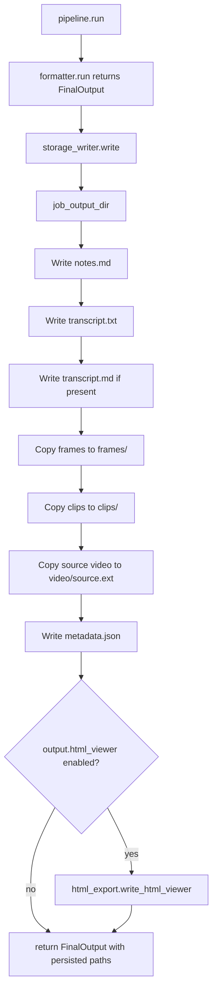
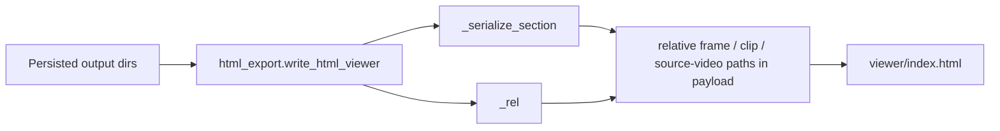
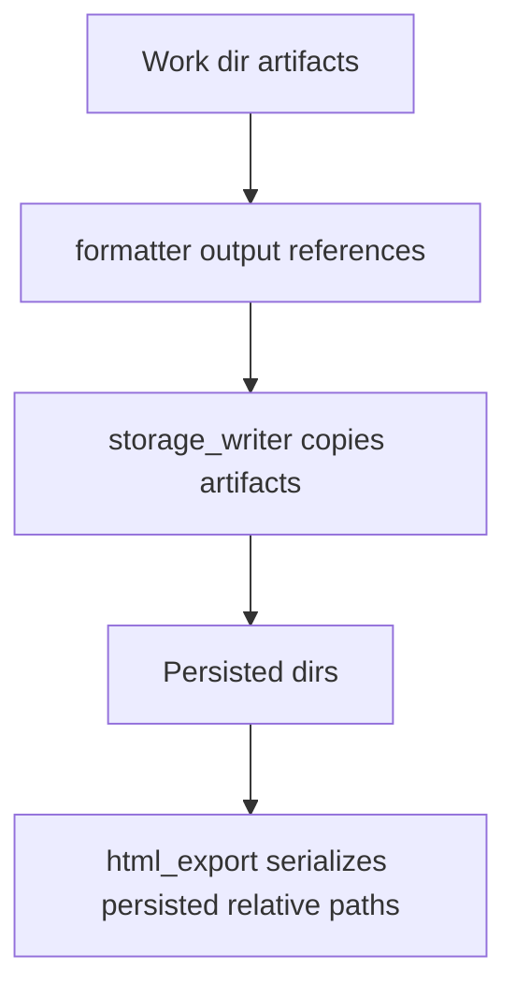

# STORAGE ARCHITECTURE

This document explains the storage path in detail. This is one of the more error-prone parts of InsightForge because it is where temporary work-dir artifacts become the final persisted output bundle, and where the static HTML viewer picks up relative paths.

Primary implementation:

- [insightforge/storage/writer.py](/Users/akarnik/experiments/InsightForge/insightforge/storage/writer.py)
- [insightforge/storage/html_export.py](/Users/akarnik/experiments/InsightForge/insightforge/storage/html_export.py)
- [insightforge/storage/paths.py](/Users/akarnik/experiments/InsightForge/insightforge/storage/paths.py)
- [insightforge/stages/formatter.py](/Users/akarnik/experiments/InsightForge/insightforge/stages/formatter.py)

## WHY STORAGE IS TRICKY

Storage is where these concerns meet:

- generated Markdown content from the formatter
- transcript data from earlier stages
- copied frame files
- copied video clips
- copied source video for the viewer
- metadata JSON
- optional HTML viewer pages
- optional cleanup of the temporary work directory

If any path handling is wrong here, the system can appear partially successful while still producing broken output.

## STORAGE FLOW



## MAIN ENTRY POINT

Primary function:
[insightforge/storage/writer.py](/Users/akarnik/experiments/InsightForge/insightforge/storage/writer.py#L20)

Function:

- `write`

Inputs:

- `FinalOutput` from the formatter
- `VideoMetadata`
- base output directory
- optional `TranscriptResult`
- optional generated audio path
- `html_enabled`
- `viewer_config`
- `cleanup_work_dir`

Outputs:

- a new `FinalOutput` with persisted paths filled in:
  - `notes_path`
  - `transcript_path`
  - `frames_dir`
  - `clips_dir`
  - `source_video_path`
  - `audio_path`
  - `html_path`
  - `notes_html_path`
  - `metadata_path`

## STEP-BY-STEP WRITE PATH

### 1. Resolve final output directory

The output directory is computed with storage path helpers. The intended pattern is:

```text
output/<sanitized_title>_<video_id>/
```

Relevant code:

- [insightforge/storage/writer.py](/Users/akarnik/experiments/InsightForge/insightforge/storage/writer.py)
- [insightforge/storage/paths.py](/Users/akarnik/experiments/InsightForge/insightforge/storage/paths.py)

### 2. Write `notes.md`

Source:

- `output.markdown_content` from the formatter

Written by:

- [insightforge/storage/writer.py](/Users/akarnik/experiments/InsightForge/insightforge/storage/writer.py#L47)

Failure symptoms:

- file missing entirely
- stale content from a previous run
- sections present in memory but not persisted

### 3. Write `transcript.txt`

Source:

- aligned `TranscriptResult`

Written by:

- `write`
- `_write_transcript`

Code:
[insightforge/storage/writer.py](/Users/akarnik/experiments/InsightForge/insightforge/storage/writer.py#L180)

Format:

- header lines beginning with `#`
- one timestamped line per transcript segment

Why it matters:

- `audio.py` depends on this file for regeneration
- humans use it for debugging transcript quality

### 4. Write `transcript.md`

Source:

- `output.transcript_md_content`

Written only if present.

Failure symptoms:

- `notes.md` exists but `transcript.md` does not
- section-level Markdown looks correct while transcript rendering is missing

### 5. Copy frames

Source:

- `output.frames_dir`, which points at the work-dir frame output

Destination:

- `<job_output>/frames/`

Code path:

- [insightforge/storage/writer.py](/Users/akarnik/experiments/InsightForge/insightforge/storage/writer.py#L66)

Behavior:

- destination is deleted and recreated when it already exists
- `copytree` is used
- if no frames exist, an empty frames dir is created

Why this is error-prone:

- generated Markdown and HTML later assume stable relative frame paths
- stale frames from a prior run can cause mismatches if the copy step is skipped or broken

### 6. Copy clips

Source:

- `output.clips_dir`

Destination:

- `<job_output>/clips/`

Code path:

- [insightforge/storage/writer.py](/Users/akarnik/experiments/InsightForge/insightforge/storage/writer.py#L76)

Behavior:

- clips dir is copied only when clips were successfully cut
- otherwise `dest_clips_dir` becomes `None`

Why this is error-prone:

- formatter and viewer may render references conditionally based on clip presence
- leaf-section clip naming must match `section_id`

### 7. Copy source video for the HTML viewer

This is one of the most important storage-specific behaviors.

Source:

- `metadata.video_path`

Destination:

- `<job_output>/video/source.<suffix>`

Code path:

- [insightforge/storage/writer.py](/Users/akarnik/experiments/InsightForge/insightforge/storage/writer.py#L94)

Why it exists:

- the viewer needs a local playable source video
- the viewer uses a relative `video_path` computed later in `html_export`

Failure symptoms:

- HTML page loads, but the video element cannot play
- transcript click-to-seek appears broken because there is no local source video

### 8. Write `metadata.json`

Code path:

- [insightforge/storage/writer.py](/Users/akarnik/experiments/InsightForge/insightforge/storage/writer.py#L103)

Fields currently written include:

- `video_id`
- `title`
- `channel`
- `duration_seconds`
- `section_count`
- `upload_date`
- `thumbnail_url`
- truncated description
- transcript word count
- transcript language

Why this matters:

- this is the machine-readable summary of the final run
- it is usually the quickest way to confirm whether the run metadata is sane

### 9. Build the HTML viewer

Condition:

- only runs when `html_enabled` is true

Code path:

- [insightforge/storage/writer.py](/Users/akarnik/experiments/InsightForge/insightforge/storage/writer.py#L118)
- [insightforge/storage/html_export.py](/Users/akarnik/experiments/InsightForge/insightforge/storage/html_export.py#L15)

Important implementation detail:

`writer.py` constructs a new `FinalOutput` for HTML export using the persisted destination directories, not the original work-dir paths. That is the key step that makes the generated viewer use the final output bundle instead of temporary paths.

## HTML EXPORT PATH HANDLING

The viewer path handling is easy to get wrong, so this is the critical relationship:



Critical functions:

- `write_html_viewer`
- `_serialize_section`
- `_rel`

Key rule:

- all file references embedded into the generated viewer must be relative to `viewer/`

Examples:

- source video path relative from `viewer/index.html` to `../video/source.mp4`
- frame paths relative from `viewer/index.html` to `../frames/...jpg`
- clip paths relative from `viewer/index.html` to `../clips/...mp4`

If these paths are wrong, the page may render but media playback, thumbnail display, and transcript-linked seeking will fail in practice.

## TEMPORARY VS PERSISTED PATHS

This distinction explains many “it works in memory but not on disk” bugs.



The formatter can still refer to logical assets, but the viewer must ultimately use the copied persisted files, not the original temporary ones.

## CLEANUP BEHAVIOR

At the end of storage, the pipeline may delete the work dir:

- controlled by `storage.cleanup_work_dir`
- default from [config/default.yaml](/Users/akarnik/experiments/InsightForge/config/default.yaml)

Why this matters:

- if output persistence is incomplete and cleanup still happens, the missing asset is gone
- if cleanup is disabled during debugging, you can inspect intermediate files

## COMMON FAILURE MODES

### Missing media in the viewer

Likely causes:

- source video was not copied
- frame copy failed
- clip copy failed
- relative path generation in `_rel` is wrong

Inspect:

- `<output>/video/`
- `<output>/frames/`
- `<output>/clips/`
- `viewer/index.html`

### HTML file exists but still reflects old behavior

Likely cause:

- the generator code changed, but the already-exported HTML file was not regenerated

Inspect:

- the actual generated `viewer/index.html`, not just `insightforge/storage/html_export.py`

### Stale assets after rerun

Likely cause:

- output directory reused with older files still present

Inspect:

- timestamps inside the output directory
- whether `copytree` replaced destination content

## HOW TO DEBUG STORAGE PROBLEMS

First enable logs:

- `insightforge process <url> --verbose`
- or `INSIGHTFORGE_LOG_LEVEL=DEBUG insightforge process <url>`

Relevant log-owning files:

- [insightforge/pipeline.py](/Users/akarnik/experiments/InsightForge/insightforge/pipeline.py)
- [insightforge/storage/writer.py](/Users/akarnik/experiments/InsightForge/insightforge/storage/writer.py)
- [insightforge/utils/ffmpeg.py](/Users/akarnik/experiments/InsightForge/insightforge/utils/ffmpeg.py)

Practical debugging sequence:

1. Confirm `notes.md`, `transcript.txt`, and `metadata.json` exist.
2. Confirm `frames/`, `clips/`, and `video/` contain expected files.
3. Open the generated `viewer/index.html` and inspect embedded relative paths.
4. If the HTML is stale, regenerate it by rerunning the pipeline with `--html on`.
5. If intermediate assets vanish too early, temporarily set `storage.cleanup_work_dir: false`.

## TESTS TO WATCH

- [tests/unit/test_writer.py](/Users/akarnik/experiments/InsightForge/tests/unit/test_writer.py)
- [tests/unit/test_html_export.py](/Users/akarnik/experiments/InsightForge/tests/unit/test_html_export.py)
- [tests/integration/test_pipeline_short.py](/Users/akarnik/experiments/InsightForge/tests/integration/test_pipeline_short.py)
